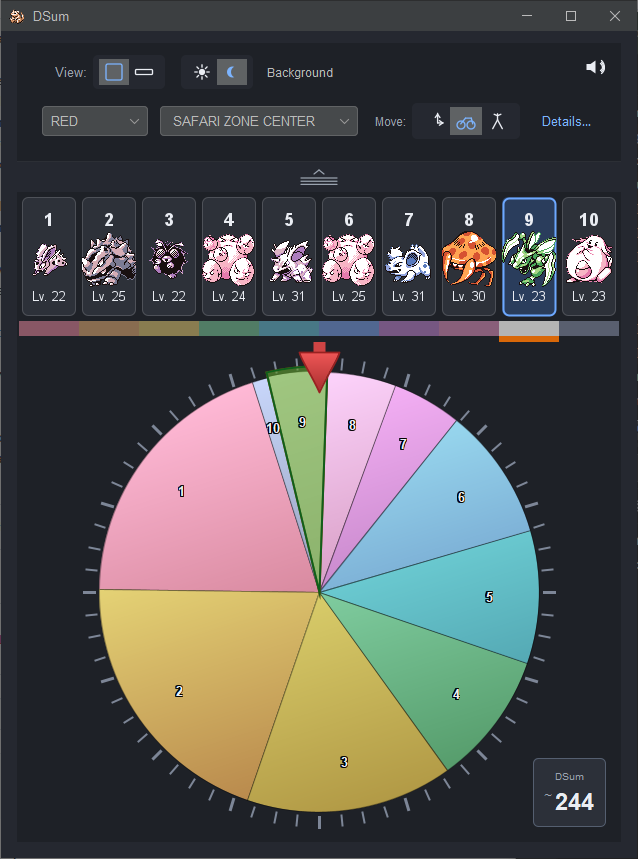

# DSum Timer application

This is a first pass at making a visual DSum timer application, which can be used
live while playing the game (rather than pre-calculated charts).

## Usage

There are 2 videos:

1. [Golduck in Seafoam](https://drive.google.com/file/d/1S16nG32QZo3U0_6VtadeCOWIxV48cy1U/view?usp=sharing)
2. [Pikachu in Forest](https://drive.google.com/file/d/10hQiSj7v5NSRKDpKphSjmGEtevBbQhkx/view?usp=sharing)

These show the basic use of the application.

### Core keys

- **[Space]** — You pressed this when the **battle wipe ends** (sync as closely as you can to the moment the encounter actually starts / the wipe animation finishes; the videos are the best guide).
- **[1]–[9], [0]** — When you dismiss **“Got away safely!”**, press the digit for the **slot you actually got** (**0** = slot 10). This **calibrates** the wheel: the timer infers where the DSum value was at encounter time and starts rotating from there in overworld (count-down) mode.

#### Optional adjustment keys (after you are used to the basics):

- **[-] / [=]** — Nudge the **uncertainty wedge** narrower or wider (manual correction if the wedge feels too pessimistic or too tight).
- **[\[] / [\]]** — Small **manual angle** nudge on the wheel (degrees per step), if you need to align the readout with a known state.
- **[Delete]** — **Clear calibration**: forget the calibrated slot, cancel an in-progress battle transition, and go back to pure overworld rotation. Does not change game, route, targets, or Yellow modifier.

## Calibration in more detail

### 1. Choose what you are hunting

Use the **encounter slot toggles** under the wheel (or the compact strip) to select **one or more target slots**. Selected targets pulse on the ring. The timer will highlight when **any** of those slots intersect the **uncertainty wedge** (see below).

### 2. Start a calibration encounter

Enter a wild battle normally. When the wipe begins, press **Space** (or **Shift+Space** if that battle used the alternate entry timing, as above).

The wheel switches to **in-battle** behaviour: DSum advances at the in-battle rate while the needle is fixed at the top.

### 3. Finish on “Got away safely!”

Run from the encounter. When the message appears and you clear it, press the number key for the **slot you just saw** (**1**–**9**, **0** for slot 10).

From that moment the app:

1. Computes where the DSum **must have been** at encounter generation from the slot midpoint, your time in battle, and the **route’s** encounter data (see **Lead level** below for animation-length correction).
2. Centers the **uncertainty wedge** on the needle: a translucent band on the wheel whose width comes from **how wide the calibrated slot is**, **how long you stayed in battle** (wedge widens as DSum completes more in-battle rotations), plus any **[-]/[=]** tweaks.
3. Returns to **overworld** rotation (DSum counting down between battles).

### 4. Hunting

When **any** selected **target** overlaps the wedge, the UI treats that as “good to search”: background tint, optional hum, and an approach bar when applicable. **Suggested** slots (the amber band along the likely chain) are a separate hint; **targets** are drawn with an extra **green** highlight on top so your goal stays obvious even when several slots in the chain are highlighted in amber.

If your first calibration is a **very wide** slot, the wedge can be huge. A common tactic is to calibrate roughly on that slot, aim at a **narrow** slot next, run another encounter on the narrow one, and calibrate again so the wedge shrinks.

### Yellow oddities

Yellow’s overworld DSum cycle length can land in a fairly wide range and **stays fixed for that save on that route** until you change it (e.g. soft reset). The app defaults to a middling cycle; if timing drifts, use the **modifier** spinner in details (steps of 10 “frame-equivalents”) to stretch or compress the overworld cycle until predictions line up.

To avoid fighting the modifier, you can **save in the area** where you DSum and **soft reset**: that tends to land the cycle near the default the app assumes, so you may not need the spinner after that.

---

## Additional controls (UI)

These do not replace the videos for basic flow; they tune the simulation to your save and play style.

### Game and route

Select the game (**Red / Blue / Yellow**) and the **route** you are on. The route table supplies **wild species and levels** per slot, which matters for calibration correction when animation length depends on **wild level vs. your lead** (see Lead level).

### Encounter slot toggles

Each column is one encounter table slot. Toggle **on** every slot you are willing to hit while hunting (your **targets**). The timer only treats overlap with **those** slots as “search now” for tint / hum / bar logic. You can select **multiple** targets.

### Movement mode (Move: corner / bike / walk)

Picks **step lag after a step** (corner **0**, bike **9**, walking **17** frames): the **wheel ring** rotates by that much (relative to the live counter) so artwork lines up with when the step “finishes” on hardware. **Overlap tint, hum, approach bar, beeps, and amber suggestions** all follow the **live** DSum and wedge—no extra bike/walk delay in that logic.

### Lead level

Your **lead Pokémon’s level** in the party. The game uses a **stronger** battle entry animation when the wild is **at least three levels above** your lead; that changes how many frames DSum advances before the wipe you see. The app uses **route + lead level** when you calibrate with a number key to correct for that, so set this to your **real** lead level before relying on fine hunting.

### Pikachu lead (Yellow only)

Visible for Yellow. Accounts for the extra **Pikachu cry** pause at battle start when Pikachu is in the lead, so Yellow timing is not systematically offset.

### Modifier (Mod) — mostly Yellow

Shown in the details row. On **Yellow**, this adjusts the assumed **overworld** DSum cycle length (see above). For Red/Blue the underlying model field exists but typical play uses the default cycle; the spinner is there for edge cases.

### Details vs. Setup (compact view)

In **full** view, **Details…** expands an inline row (lead level, modifier, Pika, etc.). In **compact** view, that row is hidden and **Setup…** opens the same controls in a small dialog so the layout stays short.

### View (full / compact)

**Full** shows the large wheel; **compact** swaps in a horizontal **strip** with the same logic (needle in the centre, scrolling slots). Use compact if you want a smaller window footprint.

### Appearance (sun / moon) and Background

- **Light / dark** theme for the UI.
- **Background** turns on **global** hotkeys (via JNativeHook) so calibration keys still fire while **another window has focus** (e.g. the emulator). Leave it off if you only want keys while the timer is focused, or if you prefer not to install global listeners.

### Sound mute

Toggles **beeps** and the **overlap hum** without affecting other system audio.
