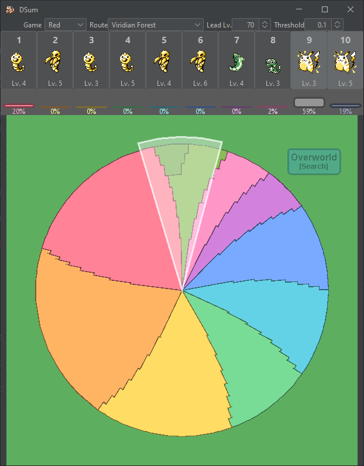

# DSum Timer application

This is a first pass at making a visual DSum timer application, which can be used
live while playing the game (rather than pre-calculated charts).

## Usage

A couple quick videos to give the idea of how this works:

1. [Scyther in Safari](https://drive.google.com/file/d/1a_D5PaYan9_6bSNX4HQiEpOfHb4vZFix/view?usp=sharing)
2. [Electabuzz in Power Plant](https://drive.google.com/file/d/12DZIDKCpm7euoXu_fbwv3ULNiQCP5srU/view?usp=sharing)
3. [Jigglypuff Route 3](https://drive.google.com/file/d/1b1zdnR1XtiCpt8Me92b5uLcd0ZvC8n3x/view?usp=sharing)
4. [NidoranM Route 22](https://drive.google.com/file/d/1YuhdNEqMVDilRCBhmK_ORrv9atVP8lUC/view?usp=sharing)
5. [Oddish Route 6](https://drive.google.com/file/d/1KVq7WPPNfXnHtd-ztNxGd76GxN7IkoC1/view?usp=sharing)
6. [Pikachu Viridian Forest](https://drive.google.com/file/d/1sjtmhk3JXeIuDOR01NkcWykcfbILiuBe/view?usp=sharing)
7. [Weezing in Mansion](https://drive.google.com/file/d/1GuXwgtBKGVgveq0K1XDwo9JUudp5wNOM/view?usp=sharing)
8. [Clefairy Mt. Moon](https://drive.google.com/file/d/1zQiCKQow4_mY48b0nGVEFwMBkjboqQql/view?usp=sharing)
9. [Golduck in Seafoam](https://drive.google.com/file/d/1d-DzRSqY7vHFN0xKmst-bCGrkXKj8y2T/view?usp=sharing)
10. [Paras Mt. Moon](https://drive.google.com/file/d/1nCt83Pz8pbrCX7CncqfttZTYQBD0LqRd/view?usp=sharing)
11. [Tentacool (high level) Surfing](https://drive.google.com/file/d/1zie9qHV20Ir2FLcNdTlIi1Fn0p6YKNSo/view?usp=sharing)

### Core keys

- **[Space]** — Marks **both ends** of an encounter, and both are timing critical (sync as closely as you can; the videos are the best guide):
  - on the way **in**, when the **battle wipe ends** / the encounter actually starts;
  - on the way **out**, when you **clear the last text box**. This **calibrates** the wheel: the timer infers where the DSum value was at encounter time and starts rotating from there in overworld (count-down) mode.
- **[1]–[9], [0]** — The **slot you actually got** (**0** = slot 10). Press this at **any point during the battle** — as soon as you can see what you ran into. Pressing the same digit again clears it. This only records the slot; it does **not** end the battle. **[Space]** will not leave the battle until a slot has been entered.

#### Optional adjustment keys (after you are used to the basics):

- **[Delete]** — **Clear calibration**: forget the calibrated slot, cancel an in-progress battle transition, clear suggested-slot highlights (until you calibrate again), and go back to pure overworld rotation. Does not change the current needle angle, game, route, lead level, Pikachu-lead flag, target slots, Yellow modifier, or outer-cycle band setting.

## Calibration in more detail

### 1. Choose what you are hunting

Use the **encounter slot toggles** under the wheel (or the compact strip) to select **one or more target slots**. Selected targets pulse on the ring. The timer will highlight when **any** of those slots intersect the **uncertainty wedge** (see below).

### 2. Start a calibration encounter

Enter a wild battle normally. When the wipe ends, press **Space**.

The wheel switches to **in-battle** behaviour: DSum advances at the in-battle rate while the needle is fixed at the top.

### 3. Enter the slot you got

At any point during the battle, press the number key for the **slot you just saw** (**1**–**9**, **0** for slot 10). There is no rush — this only records the slot, and pressing the same digit again clears it if you mistyped. The state chip shows `Slot ?` until you have entered one.

### 4. Finish on “Got away safely!”

Run from the encounter. When the message appears and you clear it, press **Space** again.

From that moment the app:

1. Computes where the DSum **must have been** at encounter generation from the slot midpoint, your time in battle, and the **route’s** encounter data (see **Lead level** below for animation-length correction).
2. Centers the **uncertainty wedge** on the needle: a translucent band on the wheel whose width comes from **how wide the calibrated slot is**, **how long you stayed in battle**.
3. Returns to **overworld** rotation (DSum counting down between battles).

For other battle end types, there are buttons which (while 'In Battle' mode) you can press to indicate the battle exit type.

- [T] = Pokemon captured and joined your party (no nickname).
- [N] = Pokemon captured and joined your party (nicknamed).
- [B] = Pokemon captured and sent to PC.
- [R] = Pokemon ran (Safari Zone exclusive).

For each of these, press the button at any time while 'In Battle' mode. They work exactly like the slot number keys: they record a choice, and it is **Space** that ends the battle when you clear the final text box.

### 5. Hunting

When **any** selected **target** overlaps the wedge, the UI treats that as “good to search”: background tint. **Suggested** slots are a separate hint; **targets** are drawn with an extra **green** highlight on top so your goal stays obvious even when several slots in the chain are highlighted in amber.

If your first calibration is a **very wide** slot, the wedge can be huge. A useful approach is to calibrate roughly on that slot, aim at any of the smaller slots, so that the large wedge covers multiple slots.  Then, you are likely to encounter a much smaller window on your next encounter.

### 6. Notes

The 'Lead Level' is only relevant if you are 3 or more levels lower than some Pokemon on the route.  This causes a different entry animation, so takes a different amount of time.

The 'threshold' is what likelihood of your targets appearing do you want the app to turn green on.  The default is 0.1 (or 10%) since (for example) certain slots can **never** go over this value (Slot 10 in the Safari Zone, for instance).

## Settings

Two tick boxes sit at the end of the settings row. Both are remembered between runs, and both start off.

### Clear found

When you encounter one of your target slots, it is dropped from the targets automatically, so hunting a
list of slots does not need the mouse to tick them off one at a time. Only the slot you actually
encountered is cleared; the rest of your targets are left alone.

### Global keys

Normally the hotkeys only work while this window has focus, which means tabbing away from the emulator.
Tick **Global keys** and they are watched system wide instead, so **[Space]**, the slot numbers and the
rest work while you are still playing.

Nothing is swallowed: keys still reach whatever application is focused. That cuts both ways — while this
is on, pressing **[R]** in a chat window will also prime an exit strategy here. Untick it when you are
done hunting. Keys pressed with **Ctrl**, **Alt** or **Cmd** held are ignored, so ordinary shortcuts in
other applications are left alone.

Watching the keyboard system wide needs permission from the operating system:

- **Windows** — works as is.
- **macOS** — requires **System Settings > Privacy & Security > Accessibility**, and enabling whatever
  you launched the app from (Terminal, or your IDE). The app has to be restarted after granting it. If
  the permission is missing, the tick box explains what to do and turns itself back off.
- **Linux** — needs an X11 session; this does not work under Wayland.

## Yellow

Support for Yellow Version is pending.